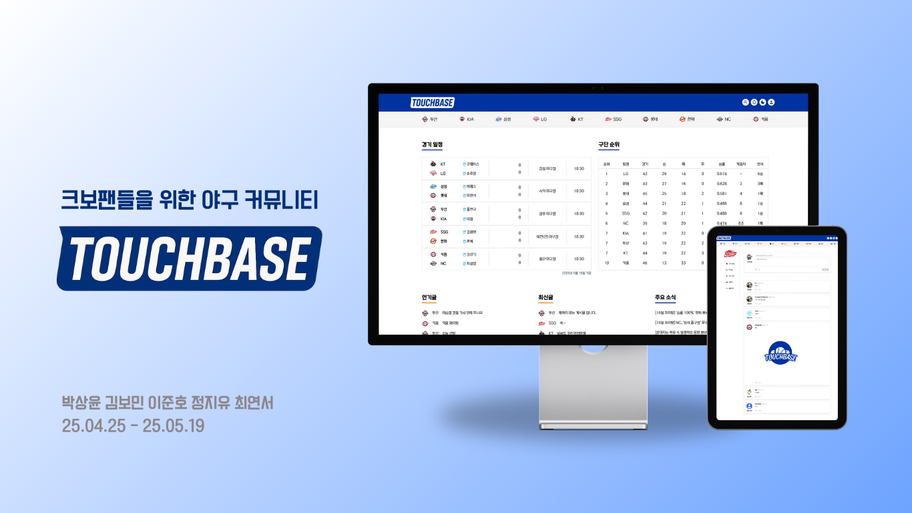

# ⚾️ KBO 팬 커뮤니티 TouchBase



- 배포 URL : https://kdt-touch-base.netlify.app
- Test ID : test@email.com
- Test PW : qwer1234

<br>

## 프로젝트 소개

- TouchBase 는 야구를 좋아하는 국내 팬들의 소통 창구로 활용할 수 있는 SNS 서비스입니다.
- 개인의 프로필에서 구단을 선택하여 응원하는 팀을 고르고 자유롭게 글을 쓸 수 있습니다.
- 응원하는 팀이 없더라도 글을 작성할 수 있습니다.
- 검색을 통해 사용자, 게시글로 소통을 이어 나갈 수 있습니다.
- 다양한 사용자들을 팔로우하며 마음에 드는 게시글에 '좋아요'를 누르거나 댓글을 작성할 수 있습니다.
- 다양한 사용자들과 DM을 주고받으며 소통을 이어 나갈 수 있습니다.

<br>

## 팀원 구성

<div align="center">

|                                                          **박상윤**                                                          |                                                              **김보민**                                                               |                                                               **이준호**                                                                |                                                               **정지유**                                                               |                                                                 **최연서**                                                                 |
| :--------------------------------------------------------------------------------------------------------------------------: | :-----------------------------------------------------------------------------------------------------------------------------------: | :-------------------------------------------------------------------------------------------------------------------------------------: | :------------------------------------------------------------------------------------------------------------------------------------: | :----------------------------------------------------------------------------------------------------------------------------------------: |
| [ <br/> @SK](https://github.com/ygvbhy) | [ <br/> @marchbom](https://github.com/marchbom) | [ <br/> @JUNHORANG](https://github.com/JUNHORANG) | [ <br/> @JINJIYU23](https://github.com/JINJIYU23) | [ <br/> @CHOIYEONSEO](https://github.com/CHOIYEONSEO) |

</div>

<br>

## 1. 개발 환경

- Front : React, TypeScript, Vite
- Back-end : 제공된 API 활용
- 버전 및 이슈관리 : Github, Notion
- 협업 툴 : Notion, Slack
- 서비스 배포 환경 : Netlify
- 디자인: [Figma](https://www.figma.com/design/IMrKyF3XKanKq0Dpm7Wq4N/touchbase?node-id=0-1&t=PoqnuSdtkT8dzggD-1)
- [커밋 컨벤션](https://github.com/FE5-2-7team/TouchBase/wiki/%EC%BD%94%EB%93%9C-%EC%BB%A8%EB%B2%A4%EC%85%98)

<br>

## 2. 폴더 구조

```plaintext
src
├── api
│   ├── auth.ts
│   ├── axiosInstance.ts
│   ├── follow.ts
│   ├── like.ts
│   ├── message.ts
│   ├── notification.ts
│   ├── posts.ts
│   ├── search.ts
│   └── user.ts
├── App.tsx
├── assets
│   ├── fonts
│   └── images
├── components
│   ├── Auth
│   ├── FanPage
│   ├── Header
│   ├── Icons
│   ├── Main
│   ├── Message
│   └── Profile
├── css
│   ├── global.css
│   ├── index.css
│   └── tailwind.css
├── hooks
│   └── useDarkMode.ts
├── layout
│   ├── Footer.tsx
│   ├── Header.tsx
│   ├── ProfileLayout.tsx
│   ├── RejectIfAuth.tsx
│   ├── RequireAuth.tsx
│   └── RootLayout.tsx
├── main.tsx
├── pages
│   ├── DetailFanPage.tsx
│   ├── EditProfilePage.tsx
│   ├── FanPage.tsx
│   ├── HomePage.tsx
│   ├── LogInPage.tsx
│   ├── MessagePage.tsx
│   ├── NotFoundPage.tsx
│   └── SignUpPage.tsx
├── router
│   └── index.tsx
├── stores
│   ├── channelStore.ts
│   ├── messageStore.ts
│   ├── newAndHotPostStore.ts
│   ├── refreshStore.ts
│   └── userStore.ts
├── swiper.d.ts
├── types
│   ├── mainGame.ts
│   ├── messageType.ts
│   ├── postType.ts
│   └── userTypes.ts
├── utils
│   ├── getLogoImages.ts
│   └── parsePost.ts
└── vite-env.d.ts
```

## 3. 역할 분담

### 박상윤

- **UI**
  - 페이지: 홈 페이지
- **기능**
  - 로그인 기능, 유저 정보 저장, 접근제한 설정
- **ETC**
  - 팀장

<br>

### 김보민

- **UI**
  - 페이지 : 메시지 함, 메시지 보내기, 헤더, 검색창, 알림창
- **기능**
  - 알림 리스트 출력, 메시지 리스트 출력, 유저/게시글 검색, 메시지 보내기,
- **디자인**
  - Figma를 활용한 메시지함, 검색 모달 디자인 시안 제작

<br>

### 이준호

- **UI**
  - 페이지 : 로그인 페이지, 회원가입 페이지, 회원 정보 수정 페이지, 404 페이지
- **기능**
  - 회원가입 유효성, 닉네임 중복 검사, 이메일 검증, 비밀번호 검증, 프로필 설정
- **디자인**
  - Figma를 활용한 프로젝트 페이지 디자인 기획 및 시안 제작

<br>

### 최연서

- **UI**
  - 페이지 : 사용자 프로필 페이지
- **기능**
  - 팔로우 및 언팔로우, 게시글 수정 및 삭제 기능,
- **ETC**
  - 발표 자료 제작 및 최종 발표 진행

<br>

### 정지유

- **UI**
  - 페이지 : 팬 페이지
- **기능**
  - 게시글 작성 기능, 최신순/인기순 정렬 기능
- **디자인**
  - Figma를 활용한 프로젝트 페이지 디자인 기획 및 시안 제작

<br>

## 4. 개발 기간

### 개발 기간

- 전체 개발 기간 : 2025.04.24 ~ 2025.05.19
- UI 구현 : 2025.05.01 ~ 2025.05.07
- 기능 구현 : 2025.05.08 ~ 2025.05.19

<br>

## 5. 페이지 별 기능

## 6. 트러블 슈팅

### 경기 일정, 순위

open API 가 없어서 KBO에서 사용하는 API 를 빌려서 사용
froxy 서버를 하나 생성 하여 서버에서 해당 API 를 요청 → CORS 오류 우회

### 인기글/최신글

이 두개의 리스트를 받아오려면 API 를 11번을 쏘고 정렬까지 진행 해야 해서 시간이 너무 오래 걸림(약 4~5초)
별도의 서버하나 개설(express 사용) 위의 내용만 실행하여 캐시데이터로 저장 후 데이터를 불러와 작업 시간 단축 (약 0.4s)
크론을 돌리기엔 물리적 서버와 실 서비스중인 프로그램이 유료인 이슈가 있어서 docker를 활용하여 1분마다 위의 api 반복 실행

### 알림 읽음처리

알림 목록을 개별 확인하고 싶었지만 seen api를 보내면 알림 하나만 클릭해도 전체 알림 읽음 처리가 됨.
→ 알림 고유 ID 값을 로컬 스토리지에 따로 저장하고 클릭할 때마다 알림 개별 아이디 값을 seen: true로 처리 (목록 빨간 점 사라짐)
이후 모든 알림의 seen이 true가 되면 그때 seen api를 보내는 것으로 변경함 (모두 읽음 처리하고 아이콘의 빨간 점을 사라지게 하기 위함)

### 채널 이동

검색 페이지에서 게시글 검색 후 이동하려고 할 때 검색 컴포넌트에서 채널 이름을 직접적으로 받을 수 없는 문제가 있었음.
→ 메인(헤더)에서 채널 api를 보낼 때 전역 상태로 저장해두고 검색 후 게시글 클릭하여 해당 게시글로 이동할 때 전역으로 저장한 채널 정보를 불러와 경로를 연결해서 이동할 수 있게 처리함

### 메세지함 사이드바 목록 갱신

메세지 보내고 나면 사이드바에 바로 목록 갱신을 하는 작업을 위해
zustand에 전역으로 refetch 상태 값을 false로 주고 클릭 이벤트 때마다 true로 변경시켜 message/conversations를 다시 불러오게 처리하여 목록 갱신함.

### 팬 페이지

- 무한 스크롤
  최신순 정렬일 때는 offset 기반으로 데이터를 불러오며 무한 스크롤이 정상적으로 작동함. 하지만 인기순 정렬의 경우, offset 단위로 게시글을 가져오면 전체 데이터를 기준으로 정확한 좋아요 수 내림차순 정렬이 어려워, 스크롤을 끝까지 내려야만 전체 게시글을 불러온 뒤에야 올바르게 정렬되는 문제 발생
  원래는 백엔드에서 인기순으로 정렬된 데이터를 페이지네이션 방식으로 제공받는 구조여야 무한 스크롤이 가능한데, 현재는 프론트에서 모든 게시글을 받아온 뒤 클라이언트에서 정렬하고 있어 이 방식과 충돌이 발생함.
  따라서 처음에는 좋아요 순으로 정렬된 게시글 배열(`a`)을 offset 기반으로 잘라서 무한 스크롤을 구현하고, 최신순 배열(`b`)은 ID 기준으로 따로 관리하려 했지만, 상태가 꼬이면서 무한 루프에 빠지는 문제가 발생.
  결국 무한 스크롤은 최신순에서만 동작하도록 제한하고, 인기순은 전체 데이터를 한 번에 불러와 클라이언트에서 정렬 후 렌더링하는 방식으로 처리.
- 댓글과 좋아요를 빠르게 클릭했을 때 서버가 다운되는 문제
  댓글 달기 버튼과 댓글 삭제, 좋아요 버튼을 빠르게 여러번 클릭했을 때 중복 요청을 방지하기 위해 클릭을 막는 로직을 구현하여 해결. 요청 도중 다시 클릭해도 무시되고, 요청이 끝나면 다음 클릭을 허용함. “요청 중 상태”를 나타내는 useState를 활용하여 빠른 중복 클릭을 막음.

### 팔로우/언팔로우 시 실시간 반영되지 않는 문제

사용자 프로필 페이지에서 팔로우/언팔로우 버튼을 클릭해도 UI에 즉시 반영되지 않는 문제가 발생.
버튼은 정상 작동했지만, React의 상태 흐름 상 동기화된 데이터로 자동 리렌더링되지 않아 UX에 혼란을 줄 수 있었음.
→ Zustand를 사용해 전역 상태로 refresh 값을 만들고, refetch() 함수로 해당 값을 토글하는 방식 도입.
useEffect에서 refresh 값을 의존성으로 감지해 데이터 재요청을 유도.

## 7. 프로젝트 후기

### 박상윤

매번 혼자서 프로젝트하다가 팀으로 해보니 새로웠습니다. 우연치않게 팀장까지 하게되어 부담이 컸지만 못난 팀장 지시에 팀원분들이 잘 따라주고 의견도 내주셔서 결과물이 좋게 나와서 만족합니다. 앞으로 더 열심히 해야겠다.

### 김보민

개발을 배우고 두번째 팀 프로젝트라 아직 부족함을 많이 느꼈지만 이번 기회로 많이 성장 했다고도 생각했다.
다들 열심히 하는 모습이 너무나도 잘 느껴졌고, 그 분위기 속에서 나 또한 같이 열심히 하게 되는 그 과정이 즐거웠다.
프로젝트 하나에도 이렇게 희노애락이 담기다니..

### 이준호

react를 활용해 팀원들과 결과물을 만들어 본 것이 처음이라 새롭고 유익한 경험이였습니다. 멘토님의 멘토링과 팀원분들을 코드를 통해 배운 것이 많아 프로젝트를 진행 하는 내내 즐거웠고 저의 부족함이 뭔지 알 수 있던 프로젝트였습니다.

### 정지유

지나온 과정을 생각하면 힘든 시간이 대부분이었지만 그만큼 많은 것을 배운 것 같다. 팀원과 소통하면서 만족스러운 프로젝트를 완성하게 된 것 같아 뿌듯하다. 다만 여전히 부족한 점이 많다고 느껴지는 만큼, 스스로를 되돌아보며 개선할 수 있는 시간을 가지려 한다.

### 최연서

흥미있는 주제로 프로젝트를 하게 되어서 재미있었다. 1차 프로젝트때 보다 긴 시간동안 프로젝트를 할 수 있어서 더 완성도 있는 결과물을 낼 수 있었던 것 같아서 좋다! 배포까지 할 수 있어서 더 만족스러운 프로젝트였다.
