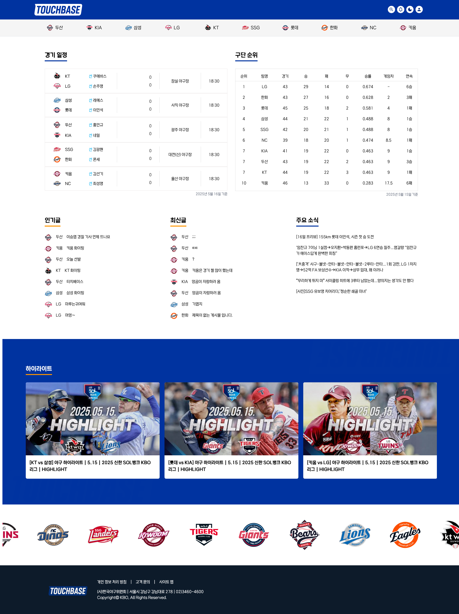

# SNS 프로젝트

## 📝 프로젝트 소개

소셜 네트워크 프로젝트
KBO 야구 소셜 네트워크
터치 베이스

- K-Digital Training: 클라우드 기반 프론트엔드 엔지니어링 7팀
- 박상윤, 김보민, 이준호, 정지유, 최연서
- 기간: 2025-04-25 (금) ~ 2025-05-19 (월)

## 🕹️ 주요 기능

### 기능 정리

- 로그인 및 인증 기능 구현 (박상윤, 이준호)
- 메인 페이지 UI/UX 설계 및 구현 (박상윤)
- 메시지함 페이지 및 헤더 컴포넌트 구현 (김보민)
- 회원가입 및 프로필 수정 기능 구현 (이준호)
- 프로필 상세 보기, 팔로우 기능 구현 (최연서)
- 쓰레드 작성, 수정 및 삭제 기능 구현 (정지유, 최연서)
- 팬 페이지 및 사용자 커뮤니티 구현 (정지유)
- 프로젝트 페이지 디자인 (이준호, 정지유)
- 발표 자료 작성 및 발표 진행 (최연서)
- 프로젝트 전반 PM 및 일정/기획 관리 (박상윤)

### 역할 분담

👨‍💼 프로젝트 매니지먼트 (박상윤)

- 프로젝트 일정 관리 및 GitHub 프로젝트 보드 운영
- 팀원 간 작업 분배 및 코드 머지(Merge) 진행
- 기능 구현 시 팀원 질문 응답 및 로직 협의 지원
- 메인 페이지 구현
- 로그인 기능 개발
- README 및 코드 컨벤션 문서 정리

⸻

👩‍💻 김보민

- 메시지함 페이지 구현
- 헤더 컴포넌트 제작 및 레이아웃 조정
- Figma를 활용한 메시지함, 검색 모달 디자인 시안 제작

⸻

👨‍💻 이준호

- 로그인, 회원가입, 404, 프로필 수정 페이지 UI 구현
- 회원가입, 프로필 수정 기능 개발
- Figma를 활용한 프로젝트 페이지 디자인 기획 및 시안 제작

⸻

👩‍💻 최연서

- 프로필 상세 보기 기능 구현
- 팔로우 및 언팔로우 기능 개발
- 쓰레드 수정 및 삭제 기능 구현
- 발표 자료 제작 및 최종 발표 진행

⸻

👩‍💻 정지유

- 팬페이지 구현 (생성, 조회 등)
- 쓰레드 작성 기능 개발
- Figma를 활용한 프로젝트 페이지 디자인 기획 및 시안 제작

⸻

🛠️ 공통 작업

- 각자 맡은 페이지의 퍼블리싱
- 다크모드 대응 스타일링
- 재사용 가능한 컴포넌트 기반 구조 설계

## 💡 기술 스택 및 협업도구

### 기술 스택

       

### 프로젝트 관리

 

### 디자인


## ✏️ Code convention

- feat: 새로운 기능 추가
- fix: 버그 수정
- docs: 문서 수정 (코드 변경 없음)
- style: 코드 스타일 수정 (포맷팅, 세미콜론 등)
- refactor: 리팩토링 (기능 변화 없음)
- chore: 빌드 설정, 패키지 매니저 설정 등 기타 잡일
- perf: 성능 개선

## 📂 폴더 구조

```plaintext
📂 폴더 구조

📦src
 ┣ 📂api             # API 요청 모듈
 ┃ ┣ 📜auth.ts
 ┃ ┗ 📜axiosInstance.ts
 ┣ 📜App.tsx         # 루트 컴포넌트
 ┣ 📂assets          # 정적 리소스 (폰트, 이미지 등)
 ┃ ┣ 📂fonts
 ┃ ┗ 📂images
 ┣ 📂components      # UI 컴포넌트 모음 (기능별로 세분화)
 ┃ ┣ 📂Auth
 ┃ ┣ 📂FanPage
 ┃ ┣ 📂Header
 ┃ ┣ 📂Icons
 ┃ ┣ 📂Main
 ┃ ┣ 📂Message
 ┃ ┗ 📂Profile
 ┣ 📂css             # 전역 스타일 및 Tailwind 설정 파일
 ┃ ┣ 📜global.css
 ┃ ┣ 📜index.css
 ┃ ┗ 📜tailwind.css
 ┣ 📂hooks           # 커스텀 훅
 ┃ ┗ 📜useDarkMode.ts
 ┣ 📂layout          # 레이아웃 컴포넌트 (공통 레이아웃, 접근 제어 등)
 ┃ ┣ 📜Footer.tsx
 ┃ ┣ 📜Header.tsx
 ┃ ┣ 📜ProfileLayout.tsx
 ┃ ┣ 📜RejectIfAuth.tsx
 ┃ ┣ 📜RequireAuth.tsx
 ┃ ┗ 📜RootLayout.tsx
 ┣ 📜main.tsx        # 애플리케이션 진입점
 ┣ 📂pages           # 라우팅되는 페이지 컴포넌트
 ┃ ┣ 📜DetailFanPage.tsx
 ┃ ┣ 📜EditProfilePage.tsx
 ┃ ┣ 📜FanPage.tsx
 ┃ ┣ 📜HomePage.tsx
 ┃ ┣ 📜LogInPage.tsx
 ┃ ┣ 📜MessagePage.tsx
 ┃ ┣ 📜NotFoundPage.tsx
 ┃ ┗ 📜SignUpPage.tsx
 ┣ 📂stores          # Zustand 상태 관리 모듈
 ┃ ┣ 📜channelStore.ts
 ┃ ┣ 📜messageStore.ts
 ┃ ┣ 📜refreshStore.ts
 ┃ ┗ 📜userStore.ts
 ┣ 📜swiper.d.ts     # Swiper 관련 타입 정의
 ┣ 📂types           # 전역 타입 정의
 ┃ ┣ 📜mainGame.ts
 ┃ ┣ 📜messageType.ts
 ┃ ┣ 📜postType.ts
 ┃ ┗ 📜userTypes.ts
 ┣ 📂utils           # 유틸리티 함수 모음
 ┃ ┣ 📜getLogoImages.ts
 ┃ ┗ 📜parsePost.ts
 ┗ 📜vite-env.d.ts   # Vite 환경 타입 정의
```

## ✅ 실행 방법

```bash
git clone

npm install

npm run dev
```

## 💻 완성 사진


